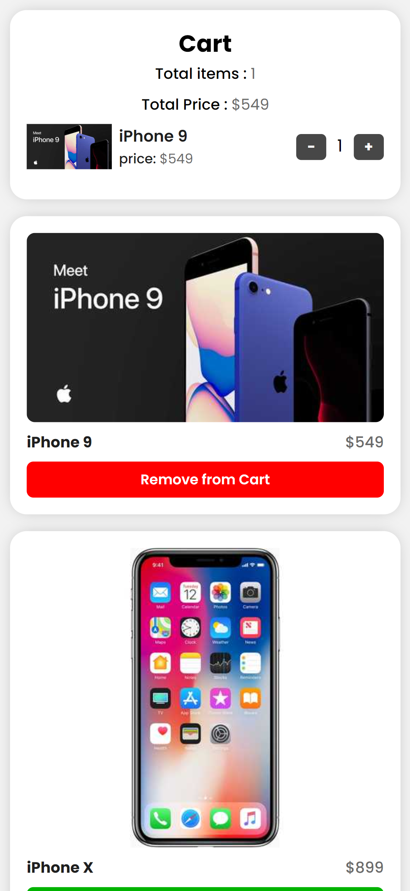
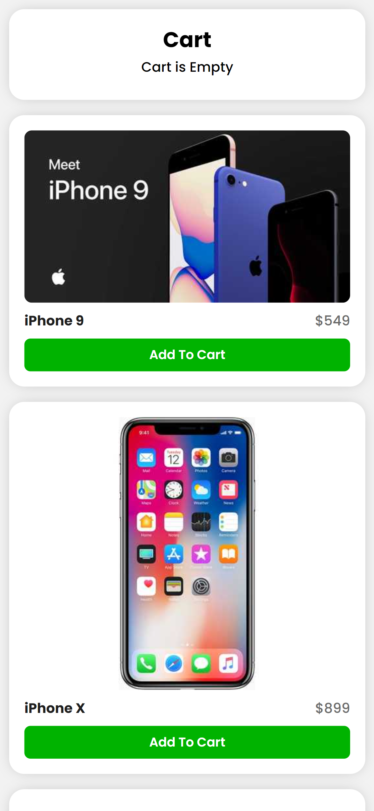

# Shopping Cart

[Shopping Cart](https://withmohitjoshi.github.io/shopping-cart/) is asimple shopping cart application. Here you will see list of product through an api call and then you can add them or remove them from the cart.

- [Shopping Cart](#shopping-cart)
    - [Links](#links)
    - [Screenshot](#screenshot)
    - [Built with](#built-with)
    - [Api Used](#api-used)
    - [Author](#author)
    - [Other Projects](#other-projects)

### Links

- Live Site URL: [Shopping Cart](https://withmohitjoshi.github.io/shopping-cart/)
- Gthub Repo: [shopping-cart](https://github.com/withmohitjoshi/shopping-cart)
 

### Screenshot

### Built with

- ReactJs
- Axios
- HTML5
- CSS3 custom properties
- Grid and Flexbox

### Api Used
 - [Dummy Json](https://dummyjson.com/products)

### Author

- Github [@withmohitjoshi](https://github.com/withmohitjoshi/About-Me)
- LinkedIn [@withmohitjoshi](https://www.linkedin.com/in/withmohitjoshi)

### Other Projects
[Projects Links](https://github.com/withmohitjoshi/Projects-Links)
